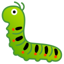
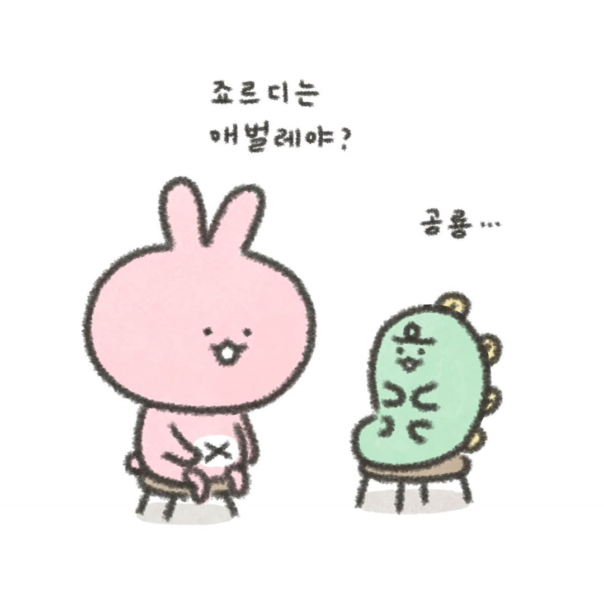

# pro-pic-gen
Profile Picture Generator from image of `noto-emoji`.



## How to Generate
1. Pick the [image][noto_emoji] and you can get unicode.  
(e.g. `U+1F41B` is (Bug) and the image is `noto-emoji/svg/emoji_u1f41b.svg`.
2. Convert `svg` to `profile.png` (256x256 or a specific size).
3. Convert `svg` to `favicon.ico` (256, 192, 128, 96, 64, 48, 40, 32, 24, 16).
```bash
brew install https://github.com/Homebrew/homebrew-core/raw/46a2ef7c9f0380b8e19f8dfe37270caa27581353/Formula/imagemagick.rb --with-librsvg    # actually, `brew install imageMagick` doesn't work properly>

# clone noto-emoji

git clone --depth 1 --branch v2020-04-08-unicode12_1 \
    https://github.com/googlefonts/noto-emoji.git && cd noto-emoji
cp ./svg/emoji_u1f41b.svg ./favicon.svg

# you may check input image size
# identify favicon.svg

# generate png image (input: 128x128, target: 512x512)
# There aren't "magic" parameter.
magick -background transparent -density "%[fx:96*512/128]" favicon.svg profile.png
# generate ico image (compress images using icon:auto-resize parameter)
magick -density "%[fx:96*256/128]" -background transparent favicon.svg \
    -define icon:auto-resize -colors 256 favicon.ico
```

Also, You can check the `favicon.ico`.
```bash
identify favicon.ico

# log
favicon.ico[0] PNG 256x256 256x256+0+0 16-bit sRGB 117654B 0.000u 0:00.003
favicon.ico[1] ICO 192x192 192x192+0+0 8-bit sRGB 0.000u 0:00.003
favicon.ico[2] ICO 128x128 128x128+0+0 8-bit sRGB 0.000u 0:00.001
favicon.ico[3] ICO 96x96 96x96+0+0 8-bit sRGB 0.000u 0:00.001
favicon.ico[4] ICO 64x64 64x64+0+0 8-bit sRGB 0.000u 0:00.000
favicon.ico[5] ICO 48x48 48x48+0+0 8-bit sRGB 0.000u 0:00.000
favicon.ico[6] ICO 40x40 40x40+0+0 8-bit sRGB 0.000u 0:00.000
favicon.ico[7] ICO 32x32 32x32+0+0 8-bit sRGB 0.000u 0:00.000
favicon.ico[8] ICO 24x24 24x24+0+0 8-bit sRGB 0.000u 0:00.000
favicon.ico[9] ICO 16x16 16x16+0+0 8-bit sRGB 416772B 0.000u 0:00.000
```


## Is :t-rex: a :bug:?
[][jordy_official]

## Reference
[jordy official][jordy_official]

## License
This code is under the [Apache License, version 2.0](./LICENSE).


<style>
img[alt="emoji_u1f41b small image"] {
  width: 32px;
}
img[alt="emoji_u1f41b normal image"] {
  width: 64px;
}
img[alt="Is jordy a bug?"] {
  width: 512px;
}
</style>

[jordy_official]: https://www.instagram.com/niniz_official
[noto_emoji]: https://www.google.com/get/noto/help/emoji/animals-nature
